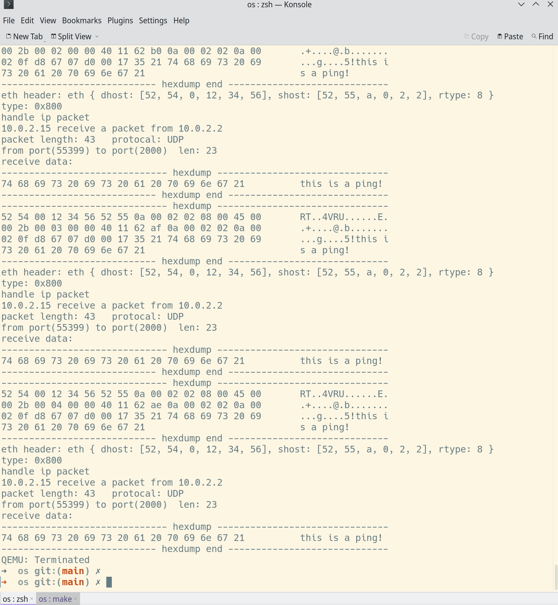

# try to impl net work in os

## 目前进度

- 对 rcore-tutorial-v3 做了一点修改
- 还没有实现相关的系统调用，目前只在内核态做了（网卡问题解决后会着手这个问题）
- 尝试添加协议栈，目前支持arp、ip、udp(receive)
- 在网卡上踩坑（花了比较多的时间，似乎没有一个文档和程序都比较完善的 `rust` `e1000` 网卡驱动）



## 运行

打开两个终端，qemu 会使用宿主机 `6200` 端口进行通信，请确保端口正常。

> 终端 1
```shell

cd rCore-Tutorial-v3/os
make run
```

> 终端2 需要确保系统安装有 python3 且在 shell 中输入 python3 命令可调用
```shell
cd rCore-Tutorial-v3/os
make ping
```

## 存在问题

> 在网卡驱动上卡了比较长的时间 .......

### virtio-net

virtio-net 没有提供中断方式，只能同步的方式使用（不是很合适）

### xv6 e1000 

成功接收到一次中断后，再次接收到中断不会进入中断函数（接收的数据也不完全对），而是显示
```shell
qemu slirp: failed to send packet, ret: -1
```
相关代码在 `rCore-Tutorial-v3/os/src/pci.e1000`

### rCore/zCore e1000e

接收一次中断后无法再接收到中断或者直接就检测不到中断， 相关代码在 `rCore-Tutorial-v3/os/src/pci.e1000e`